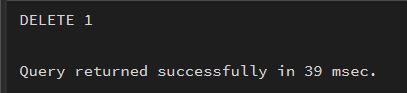
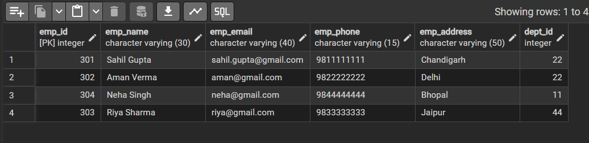

# Experiment 1

## Aim of the Session
To design and implement a sample organizational database system using SQL commands,
including Data Definition Language (DDL), Data Manipulation Language (DML), and Data
Control Language (DCL).
The practical demonstrates database creation, table relationships using foreign keys, data
insertion and modification, schema alteration, and role-based access control to ensure data
integrity and secure access for authorized users.

## Objective of the Session
- To understand and apply DDL commands such as CREATE, ALTER, and DROP
• To perform DML operations like INSERT, UPDATE, DELETE, and SELECT
• To implement DCL commands including CREATE ROLE, GRANT, and REVOKE
• To enforce referential integrity using primary keys and foreign keys
• To provide controlled and secure access using role-based privileges
• To gain hands-on experience using PostgreSQL in a real database environment

##S/W Requirement 
Oracle Database Express Edition and  pgAdmin

## Objectives
To gain practical experience in implementing Data Definition Language (DDL), Data Manipulation Language (DML), and Data Control Language (DCL) operations in a real database environment. This will also include implementing role-based privileges to secure data.
Given:
An organization wants to design a sample database system to manage Departments, Employees, and Projects. The database must ensure data integrity, controlled access, and proper privilege management for different users.

##Procedure of the Experiment

- The PostgreSQL database server was started and the pgAdmin tool was opened to execute SQL commands.
- A relational database structure was designed by creating three tables: Department, Employee, and Project, using Data Definition Language (DDL) commands.
- Appropriate PRIMARY KEY and FOREIGN KEY constraints were defined to establish relationships between the tables and to maintain referential integrity.
- Additional constraints such as NOT NULL and UNIQUE were applied to important attributes to ensure data validity and consistency.
- Sample records were inserted into all the tables using Data Manipulation Language (DML) commands to populate the database with meaningful data.
- The inserted records were verified using SELECT queries to ensure successful data insertion.
- Existing data in the Employee table was modified using the UPDATE command to demonstrate data modification operations.
- Selected records were removed from the Employee table using the DELETE command while observing the effect of foreign key constraints.
- A database role named HR was created to demonstrate role-based access control.
- Required privileges were granted to the HR role using the GRANT command to allow controlled access to database objects.
- Certain privileges were revoked using the REVOKE command to restrict unauthorized access to sensitive tables.
- The structure of the database was modified using the ALTER TABLE command to add a new column to an existing table.
- An unused table was removed from the database using the DROP TABLE command to demonstrate schema modification.
- All operations were verified through appropriate output queries and permission checks.

## Practical steps of the Experiment
### 1.	Database Design
○	Create multiple tables such as Department, Employee, and Project.
○	Define appropriate PRIMARY KEY and FOREIGN KEY constraints.
○	Enforce NOT NULL, UNIQUE, and CHECK constraints where necessary.

### 2.	Data Manipulation
○	Insert sample records into all tables.
○	Perform UPDATE operations to modify existing records.
○	Perform DELETE operations while maintaining referential integrity.

### 3.	Access Control & Security
○	Create a role/user for a reporting staff member.
○	Grant ONLY SELECT privilege on required tables to this role/user.
○	Explicitly REVOKE CREATE privilege so that the user cannot create any database objects.
○	Ensure the user has read-only access to the database.

### 4.	Schema Modification
○	Use ALTER TABLE to add or modify a column.
○	Drop a table that is no longer required using DROP TABLE.

## Input / Output Details
### Input:
- SQL commands for table creation.
- Data records for Department, Employee, and Project.
- Update and delete queries.
- Role creation and permission commands.
- 
### Output:
- Successfully created tables with constraints.
- Inserted records displayed using SELECT statements.
- Updated employee department reflected in the output.
- Deleted employee removed from the table.
- Role created and permissions granted/revoked successfully.

## Learning Outcome
- Learned how to design relational database schemas.
- Understood the use of primary and foreign key constraints.
- Gained hands-on experience with data insertion, update, and deletion.
- Learned the effect of cascading updates and delete rules.
- Acquired knowledge of role-based access control in SQL.
- Improved practical understanding of database management operations.

## Screenshots
### Step 1: Department Table 

### Step 2: Employee Table 

### Step 3: Project Table 

### Step 4: UPDATE on Employee table

### Step 5: Delete on Employee table

### Step 6: After updation and deletion(employee table)

### Step 7: After creating role Providing Grant permission to the HR

### Step 8: Revoking the select permission from HR using REVOKE

### Step 9: Permission denied (because of REVOKE) on the HR 

