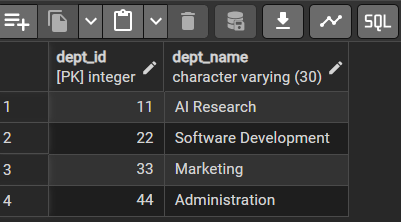

# Experiment 1

## Aim of the Session
To design and implement a sample organizational database system using SQL commands,
including Data Definition Language (DDL), Data Manipulation Language (DML), and Data
Control Language (DCL).
The practical demonstrates database creation, table relationships using foreign keys, data
insertion and modification, schema alteration, and role-based access control to ensure data
integrity and secure access for authorized users.

## Objective of the Session
- To understand and apply DDL commands such as CREATE, ALTER, and DROP
• To perform DML operations like INSERT, UPDATE, DELETE, and SELECT
• To implement DCL commands including CREATE ROLE, GRANT, and REVOKE
• To enforce referential integrity using primary keys and foreign keys
• To provide controlled and secure access using role-based privileges
• To gain hands-on experience using PostgreSQL in a real database environment

## Practical / Experiment Steps
- Create tables Department, Employee, and Project with appropriate constraints.
- Establish relationships between tables using foreign keys.
- Insert sample records into all tables.
- Retrieve data using SELECT statements.
- Update existing employee records.
- Delete an employee record and observe referential behavior.
- Create a database role and assign permissions.
- Revoke selected permissions from the role.

## Procedure of the Experiment
1. Start the system and log in to the computer.
2. Open the SQL database software (PostgreSQL / MySQL / Oracle).
3. Create the Department table with primary key and unique constraints.
4. Create the Employee table with foreign key reference to the Department table.
5.Create the Project table with foreign key reference to the Employee table.
6. Insert sample records into Department, Employee, and Project tables.
7. Display table contents using SELECT queries.
8. Update the department of an employee using the UPDATE command.
9. Delete an employee record and observe the effect on related tables.
10. Create a database role and grant required permissions.
11. Revoke selected permissions from the role.
12. Verify successful execution of each command.
13. Save the work and capture screenshots of outputs.

## Input / Output Details
### Input:
- SQL commands for table creation.
- Data records for Department, Employee, and Project.
- Update and delete queries.
- Role creation and permission commands.
- 
### Output:
- Successfully created tables with constraints.
- Inserted records displayed using SELECT statements.
- Updated employee department reflected in the output.
- Deleted employee removed from the table.
- Role created and permissions granted/revoked successfully.

## Learning Outcome
- Learned how to design relational database schemas.
- Understood the use of primary and foreign key constraints.
- Gained hands-on experience with data insertion, update, and deletion.
- Learned the effect of cascading updates and delete rules.
- Acquired knowledge of role-based access control in SQL.
- Improved practical understanding of database management operations.

## Screenshots
### Step 1: Department Table 

### Step 2: Employee Table 

### Step 3: Project Table 

### Step 4: UPDATE on Employee table

### Step 5: Delete on Employee table

### Step 6: After updation and deletion(employee table)

### Step 7: After creating role Providing Grant permission to the HR

### Step 8: Revoking the select permission from HR using REVOKE

### Step 9: Permission denied (because of REVOKE) on the HR 

