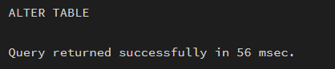
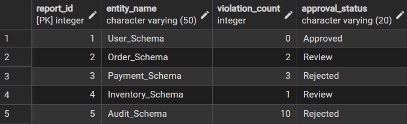
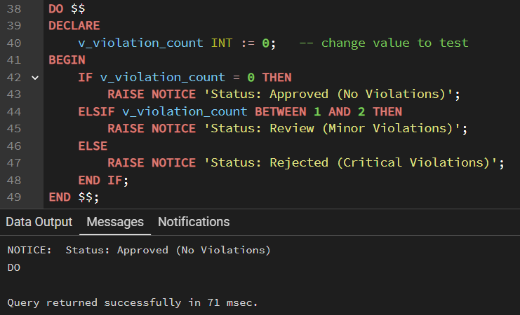

# Experiment 3

## Aim of the Session
To implement conditional decision-making logic in PostgreSQL using IF–ELSE constructs and CASE expressions for classification, validation, and rule-based data processing.

## Objective of the Session
-	To understand conditional execution in SQL
-	To implement decision-making logic using CASE expressions
-	To simulate real-world rule validation scenarios
-	To classify data based on multiple conditions
-	To strengthen SQL logic skills required in interviews and backend system

## S/W Requirement 
PostgreSQL
## Theory
In real-world database systems, data often needs to be validated, categorized, or transformed based on business rules. Conditional logic allows the database to make decisions dynamically instead of relying solely on application-layer logic.
PostgreSQL supports conditional logic mainly through:
-	CASE Expressions (used inside SELECT, UPDATE, INSERT)
-	IF–ELSE constructs (used inside PL/pgSQL blocks such as functions and procedures)

### CASE Expression
-	Evaluates conditions sequentially
-	Returns a value based on the first true condition
-	Can be used in SELECT, UPDATE, ORDER BY, and WHERE clauses

### Types of CASE
-	Simple CASE → compares expressions
-	Searched CASE → evaluates boolean conditions

Conditional logic is heavily used in:
-	Data classification (grades, salary slabs)
-	Violation detection
-	Status mapping
-	Business rule enforcement

Companies like Amazon, SAP, Oracle, and Adobe frequently test CASE-based logic in SQL interviews.

## Procedure of the Experiment

### Prerequisite Understanding
Students should first create a table that stores:
-	A unique identifier
-	A schema or entity name
-	A numeric count representing violations or issues
Populate the table with multiple records having different violation counts.
### Step 1: Classifying Data Using CASE Expression
Task for Students:
-	Retrieve schema names and their violation counts.
-	Use conditional logic to classify each schema into categories such as:
--No Violation
--Minor Violation
--	Critical Violation
Learning Focus:
-	Using searched CASE
-	Sequential condition checking
-	Real-world compliance reporting logic
### Step  2: Applying CASE Logic in Data Updates
Task for Students:
-	Add a new column to store approval status.
-	Update this column based on violation count using conditional rules such as:
--	Approved
--	Needs Review
-- Rejected
Learning Focus:
-	Automating decisions inside the database
-	Reducing application-side logic
-	Using CASE inside UPDATE statements
### Step  3: Implementing IF–ELSE Logic Using PL/pgSQL
Task for Students:
-	Use a procedural block instead of a SELECT statement.
-	Declare a variable representing violation count.
-	Display different messages based on the value of the variable using IF–ELSE logic.
Learning Focus:
-	Understanding procedural SQL
-	ELSE-IF ladder execution
-	Backend validation logic in stored procedures
### Step 4: Real-World Classification Scenario (Grading System)
Task for Students:
-	Create a table to store student names and marks.
-	Classify students into grades based on their marks using conditional logic.
Learning Focus:
-	Common interview use case
-	Data categorization
-	Rule-based evaluation
### Step 5: Using CASE for Custom Sorting
Task for Students:
-	Retrieve schema details.
-	Apply conditional priority while sorting records based on violation severity.
Learning Focus:
-	Advanced CASE usage
-	Custom ordering logic and Dashboard and reporting scenarios

### 4.	Schema Modification
○	Use ALTER TABLE to add or modify a column.
○	Drop a table that is no longer required using DROP TABLE.

## Learning Outcome
This experiment demonstrates how conditional logic is implemented in PostgreSQL using CASE expressions and IF–ELSE constructs.
 Students gain strong command over rule-based SQL logic, which is essential for:
-	Backend systems
-	Analytics
-	Compliance reporting
-	Placement and technical interviews

## Screenshots
### Step 1: Schema_analysis table

### Step 2 : CLASSIFYING DATA USING CASE EXPRESSION (case statement) 

### Applying CASE Logic in Data Updates(Alter table)

### Step 3: After updation on the table

### Step 4: Implementing IF–ELSE Logic Using PL/pgSQL
### Test case 1 

### Test case 2 

