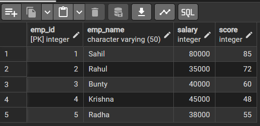
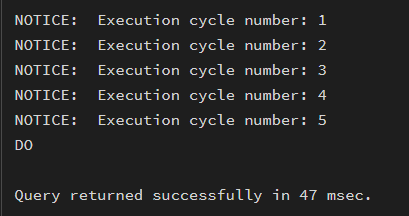
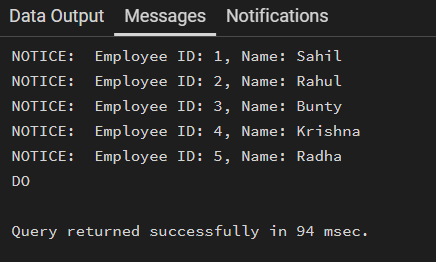
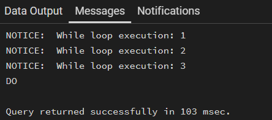
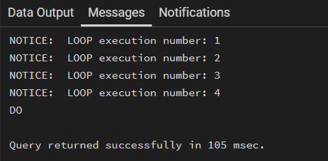
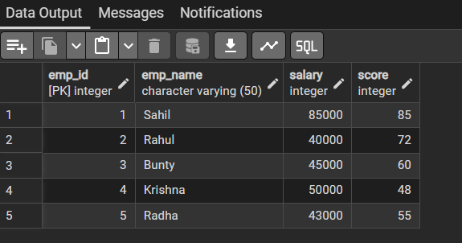

# Experiment 4

## Aim of the Session
To understand and implement iterative control structures in PostgreSQL conceptually, including FOR loops, WHILE loops, and basic LOOP constructs, for repeated execution of database logic.

## Objective of the Session
-	To understand why iteration is required in database programming
-	To learn the purpose and behavior of FOR, WHILE, and LOOP constructs
-	To understand how repeated data processing is handled in databases
-	To relate loop concepts to real-world batch processing scenarios
-	To strengthen conceptual knowledge of procedural SQL used in enterprise systems

## S/W Requirement 
- PostgreSQL

## Theory
In real-world database applications, tasks often need to be repeated multiple times. Examples include processing employee records, generating reports, validating data, applying salary increments, and running batch jobs. Standard SQL is declarative and works well for single operations, but repeated logic requires procedural control.
PostgreSQL provides PL/pgSQL, a procedural extension that supports iteration using loop structures. These loops allow SQL statements to execute repeatedly until a specific condition is met.
Iteration in PostgreSQL is commonly used inside:
-	Stored procedures
-	Functions
-	Anonymous execution blocks
Large organizations such as Amazon, SAP, Oracle, and Rippling use loop-based logic for payroll processing, billing cycles, analytics, and automation workflows.

## Types of Loops in PostgreSQL
### FOR Loop (Range-Based)
-	Executes a fixed number of times
-	Useful when the number of iterations is known in advance
-	Commonly used for counters, testing, and batch execution
### FOR Loop (Query-Based)
-	Iterates over rows returned by a query
-	Processes one row at a time
-	Frequently used for reporting, audits, and row-wise calculations
### WHILE Loop
-	Executes repeatedly as long as a condition remains true
-	Suitable for condition-controlled execution
-	Often used in retry logic or threshold-based processing
### LOOP with EXIT Condition
-	Executes indefinitely until explicitly stopped
-	Provides maximum control over execution flow
-	Used in complex workflows where exit conditions are custom-defined

## Experiment Steps

### Example 1: FOR Loop – Simple Iteration
-	The loop runs a fixed number of times
-	Each iteration represents one execution cycle
-	Useful for understanding basic loop behavior
Application: Counters, repeated tasks, batch execution

### Example 2: FOR Loop with Query (Row-by-Row Processing)
-	The loop processes database records one at a time
-	Each iteration handles a single row
-	Simulates cursor-based processing
Application: Employee reports, audits, data verification

### Example 3: WHILE Loop – Conditional Iteration
-	The loop runs until a condition becomes false
-	Execution depends entirely on the condition
-	The condition is checked before every iteration
Application: Retry mechanisms, validation loops

### Example 4: LOOP with EXIT WHEN
-	The loop does not stop automatically
-	An explicit exit condition controls termination
-	Gives flexibility in complex logic
Application: Workflow engines, complex decision cycles

### Example 5: Salary Increment Using FOR Loop
-	Employee records are processed one by one
-	Salary values are updated iteratively
-	Represents real-world payroll processing
Application: Payroll systems, bulk updates

### Example 6: Combining LOOP with IF Condition
-	Loop processes each record
-	Conditional logic classifies data during iteration
-	Demonstrates decision-making inside loops
Application: Employee grading, alerts, categorization logic

## RESULT:
This experiment helps students understand how iterative control structures work in PostgreSQL at a conceptual level. Students learn where and why loops are used in database systems and gain foundational knowledge required for writing procedural logic in enterprise-grade applications.

## Learning Outcome
- Understand the need for iteration in database programming
- Learn the use of FOR, WHILE, and LOOP constructs in PostgreSQL
- Perform row-by-row processing using query-based FOR loops
- Use RECORD and scalar variables correctly in loops
- Apply conditional logic inside loops
- Execute batch operations such as salary updates
- Understand control flow using EXIT conditions
- Gain basic proficiency in PL/pgSQL programming

## Screenshots
### EMPLOYEE TABLE

### EXAMPLE 1: For loop (Simple Iteration)

### Example 2: For loop with query(Row-by-Row processing)

### Example 3 : While LOOP - Conditional Iteration

### Example 4 : LOOP with EXIT WHEN

### Example 5: Salary increment Using For LOOP

- Salary increased by 5000 for each employee

### Example 6: Combining LOOP and IF Condition	

