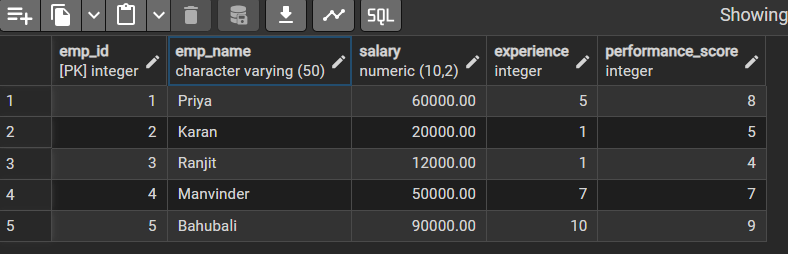
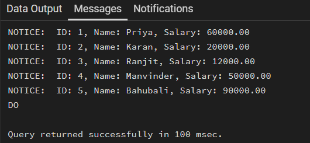
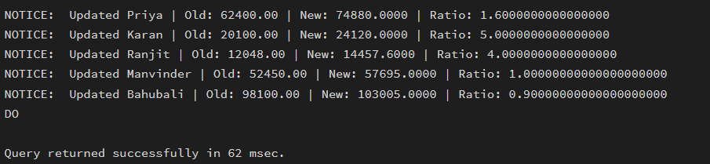
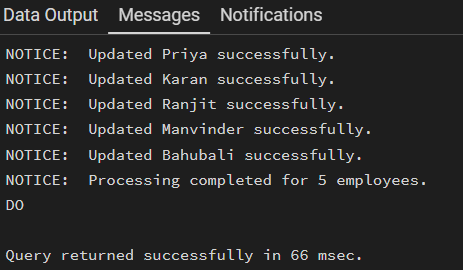

# WORKSHEET 5 – Cursor Implementation in PostgreSQL

## Student Information
- Name: Sahil Gupta  
- UID: 25MCI10266  
- Branch: MCA (AI & ML)  
- Section: 25 MAM-1 A  
- Semester: 2nd Semester  
- Subject: Technical Skills  
- Date of Performance: 12/01/2026  

---

## AIM
To gain hands-on experience in creating and using cursors for row-by-row processing in a database, enabling sequential access and manipulation of query results for complex business logic.  
(Company Tags: Infosys, Wipro, TCS, Capgemini)

---

## Software Requirement
- Oracle Database Express Edition  
- PostgreSQL  
- pgAdmin  

---

## OBJECTIVES
- Sequential Data Access using cursors  
- Row-Level Manipulation with procedural logic  
- Cursor Lifecycle Management (Declare, Open, Fetch, Close)  
- Exception Handling during large-scale iteration  

---

# Practical / Experiment Steps

---

## Table Creation

```sql
CREATE TABLE Employee (
    emp_id SERIAL PRIMARY KEY,
    emp_name VARCHAR(50),
    salary NUMERIC(10,2),
    experience INT,           
    performance_score INT     
);
```

### Insert Sample Values

```sql
INSERT INTO Employee (emp_name, salary, experience, performance_score) VALUES
('Priya', 60000, 5, 8),
('Karan', 20000, 1, 5),
('Ranjit', 12000, 1, 4),
('Manvinder', 50000, 7, 7),
('Bahubali', 90000, 10, 9);
```

### Output


---

## Step 1: Simple Forward-Only Cursor

```sql
DO $$
DECLARE
    emp_record RECORD;      -- Variable to hold one row
    emp_cursor CURSOR FOR   -- Declare cursor
        SELECT emp_id, emp_name, salary
        FROM Employee;
BEGIN

    OPEN emp_cursor;   -- Open cursor

    LOOP
        FETCH emp_cursor INTO emp_record;   -- Fetch one row

        EXIT WHEN NOT FOUND;   -- Exit when no more rows

        RAISE NOTICE 'ID: %, Name: %, Salary: %',
                     emp_record.emp_id,
                     emp_record.emp_name,
                     emp_record.salary;
    END LOOP;
    CLOSE emp_cursor;   -- Close cursor
END $$;
```

### Output


---

## Step 2: Complex Row-by-Row Manipulation

```sql
DO $$
DECLARE
    emp_record RECORD;
    emp_cursor CURSOR FOR
        SELECT emp_id, emp_name, salary, experience, performance_score
        FROM Employee;

    ratio NUMERIC;
    new_salary NUMERIC;
BEGIN

    OPEN emp_cursor;

    LOOP
        FETCH emp_cursor INTO emp_record;
        EXIT WHEN NOT FOUND;

        -- Prevent division by zero
        IF emp_record.experience = 0 THEN
            RAISE NOTICE 'Skipping % due to zero experience',
                emp_record.emp_name;
            CONTINUE;
        END IF;

        -- Calculate ratio
        ratio := emp_record.performance_score::NUMERIC 
                 / emp_record.experience;

        -- Apply business logic
        IF ratio >= 1.5 THEN
            new_salary := emp_record.salary * 1.20;
        ELSIF ratio >= 1.0 THEN
            new_salary := emp_record.salary * 1.10;
        ELSIF ratio >= 0.5 THEN
            new_salary := emp_record.salary * 1.05;
        ELSE
            new_salary := emp_record.salary;
        END IF;

        -- Update row
        UPDATE Employee
        SET salary = new_salary
        WHERE emp_id = emp_record.emp_id;

        RAISE NOTICE 'Updated % | Old: % | New: % | Ratio: %',
            emp_record.emp_name,
            emp_record.salary,
            new_salary,
            ratio;

    END LOOP;

    CLOSE emp_cursor;

END $$;
```

### Output


---

## Step 3: Exception and Status Handling

```sql
DO $$
DECLARE
    emp_record RECORD;
    emp_cursor CURSOR FOR
        SELECT emp_id, emp_name, salary, experience, performance_score
        FROM Employee;

    ratio NUMERIC;
    new_salary NUMERIC;
    row_count INT := 0;

BEGIN
    OPEN emp_cursor;

    LOOP
        FETCH emp_cursor INTO emp_record;
        EXIT WHEN NOT FOUND;

        row_count := row_count + 1;

        BEGIN
            -- This will throw error if experience = 0
            ratio := emp_record.performance_score::NUMERIC
                     / emp_record.experience;
					 
			--  new_salary := 'abc';		-- error occurance
            IF ratio >= 1.5 THEN
                new_salary := emp_record.salary * 1.20;
            ELSIF ratio >= 1.0 THEN
                new_salary := emp_record.salary * 1.10;
            ELSIF ratio >= 0.5 THEN
                new_salary := emp_record.salary * 1.05;
            ELSE
                new_salary := emp_record.salary;
            END IF;

            UPDATE Employee
            SET salary = new_salary
            WHERE emp_id = emp_record.emp_id;

            RAISE NOTICE 'Updated % successfully.',
                emp_record.emp_name;

        EXCEPTION
            WHEN division_by_zero THEN
                RAISE NOTICE '❌ Division by zero for employee: %',
                    emp_record.emp_name;

            WHEN OTHERS THEN
                RAISE NOTICE '⚠ Unexpected error for employee: %',
                    emp_record.emp_name;
        END;

    END LOOP;

    CLOSE emp_cursor;

    IF row_count = 0 THEN
        RAISE NOTICE 'No employees found.';
    ELSE
        RAISE NOTICE 'Processing completed for % employees.',
            row_count;
    END IF;

EXCEPTION
    WHEN OTHERS THEN
        RAISE NOTICE '🚨 Fatal error occurred: %', SQLERRM;
END $$;
```

### Output


---

# Outcomes
- Students will be able to implement and manage cursors for row-wise processing.
- Demonstrate lifecycle management of cursors.
- Handle exceptions effectively during iteration.
- Apply cursor logic to real-world payroll and enterprise scenarios.

---

## Conclusion
This experiment demonstrated practical implementation of cursors in PostgreSQL for sequential row processing, dynamic data manipulation, and structured exception handling in enterprise-level database systems.
