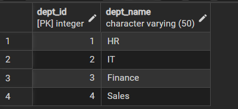
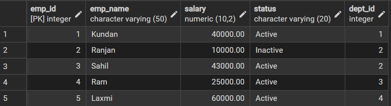
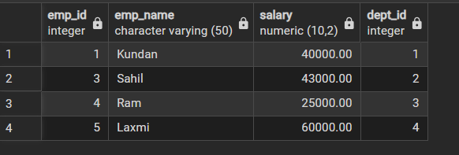
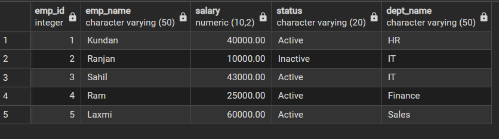
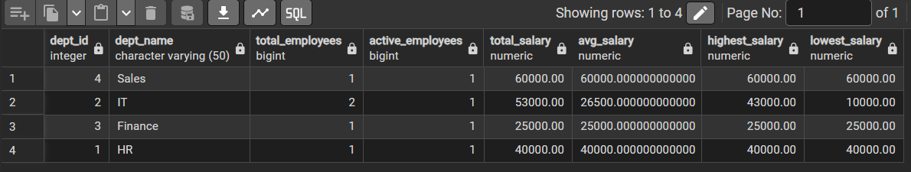

# WORKSHEET 6 – SQL Views Implementation

## Student Information
- Name: Sahil Gupta
- UID: 25MCI10266
- Branch: MCA (AI & ML)  
- Section: 25MAM-1 A  
- Semester: 2nd Semester  
- Subject: Technical Skills  
- Date of Performance: 12/01/2026  

---

## AIM
Learn how to create, query, and manage views in SQL to simplify database queries and provide a layer of abstraction for end-users.

---

## Software Requirement
- Oracle Database Express Edition  
- PostgreSQL  
- pgAdmin  

---

## OBJECTIVES
- Data Abstraction: Hide complex joins and logic behind simple virtual tables.  
- Enhanced Security: Restrict access to sensitive columns using views.  
- Query Simplification: Pre-join multiple tables for easier reporting.  
- View Management: Understand creation, alteration, and deletion of views.  

---

# Practical / Experiment Steps

---

## Table Creation
```sql
CREATE TABLE Department (
    dept_id SERIAL PRIMARY KEY,
    dept_name VARCHAR(50)
);
```
```sql
Create table employee(
     Emp_id serial primary key,
     Emp_name varchar (50),
     Salary numeric(10,2),
     Status varchar(20),
     Dept_id int references department(dept_id)
);
```

## Insertion in tables
```sql
INSERT INTO Department (dept_name) VALUES
('HR'),
('IT'),
('Finance'),
('Sales');
```
```sql
INSERT INTO employee(emp_name, salary, status, dept_id) VALUES 
('Kundan',40000,'Active', 1),
('Ranjan', 10000,'Inactive',2),
('Sahil', 43000,'Active', 2),
('Ram', 25000,'Active',3),
('Laxmi', 60000,'Active', 4);
```

### Department Table Employee Table





---

## Step 1: Creating a Simple View for Data Filtering

```sql
CREATE VIEW Active_Employees AS
SELECT emp_id, emp_name, salary, dept_id
FROM Employee
WHERE status = 'Active';
```

### Output


---

## Step 2: Creating a View for Joining Multiple Tables

```sql
CREATE VIEW Employee_Department_View AS
SELECT 
    e.emp_id,
    e.emp_name,
    e.salary,
    e.status,
    d.dept_name
FROM Employee e
JOIN Department d
    ON e.dept_id = d.dept_id;
```

### Output


---

## Step 3: Advanced Summarization View

```sql
CREATE VIEW Department_Salary_Summary AS
SELECT 
    d.dept_id,
    d.dept_name,
    COUNT(e.emp_id) AS total_employees,
    COUNT(CASE WHEN e.status = 'Active' THEN 1 END) AS active_employees,
    SUM(e.salary) AS total_salary,
    AVG(e.salary) AS avg_salary,
    MAX(e.salary) AS highest_salary,
    MIN(e.salary) AS lowest_salary
FROM Department d
LEFT JOIN Employee e
    ON d.dept_id = e.dept_id
GROUP BY d.dept_id, d.dept_name;
```

### Output


---

## Outcomes
- Abstraction Proficiency: Create and query views for efficient data abstraction.  
- Security Implementation: Use views for restricted access and data masking.  
- Syntactic Accuracy: Demonstrate correct view creation and management syntax.  
- Real-world Application: Design views for practical domains like Payroll or Library Systems.  

---

## Conclusion
This experiment demonstrated how SQL views provide abstraction, simplify queries, enhance security, and support efficient reporting in enterprise-level database systems.
