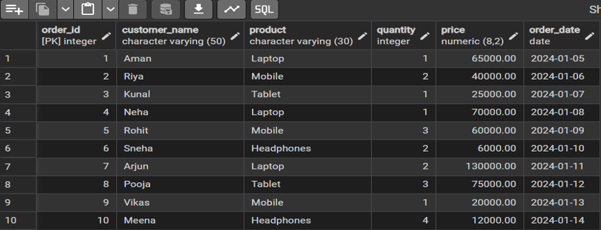
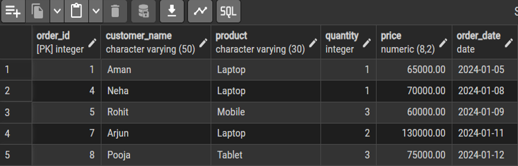
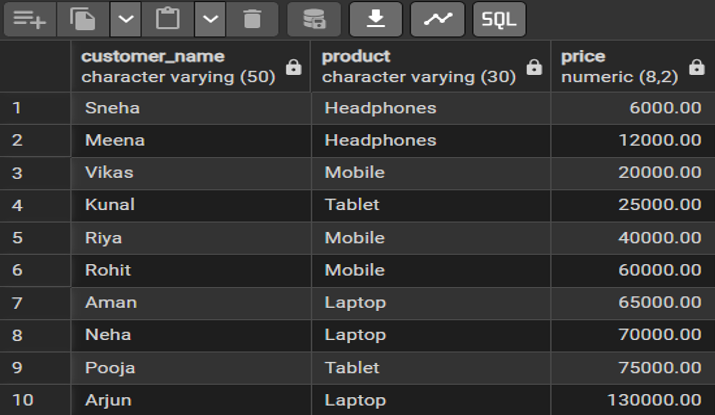
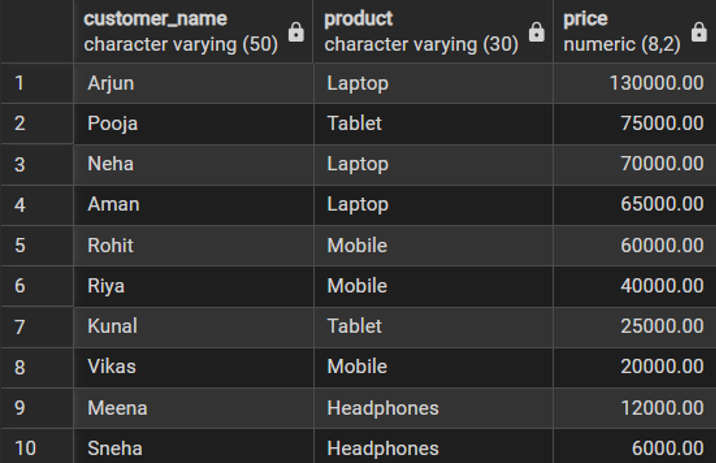
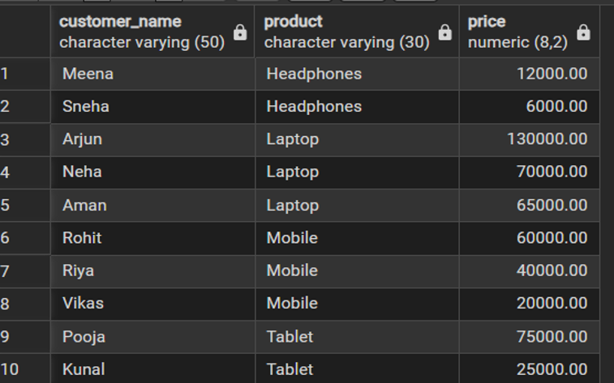
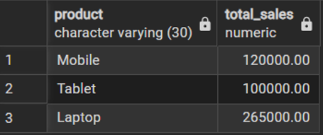

# Experiment 2

## Aim of the Session
To analyze student performance data using SQL queries by applying conditional logic (CASE statement) and 
aggregate functions to identify high-performing students across different cities.

## Software Requirements
● PostgreSQL  
•	PostgreSQL (Database Server)   
•	pgAdmin (Graphical User Interface)   
•	SQL Queries (DDL, DML, DCL commands)   

## Objective of the Session
●	To retrieve specific data using filtering conditions  
●	To sort query results using single and multiple attributes  
●	To perform aggregation using grouping techniques  
●	To apply conditions on aggregated data  
●	To understand real-world analytical queries commonly asked in placement interviews 

## Practical / Experiment Steps
- Analyze the given Students database table.
- Identify students whose percentage is greater than 95.
- Use CASE statement to count students meeting the condition.
- Calculate city-wise average percentage for students scoring above 95.
- Sort the results based on percentage in descending order.
- Execute the queries and verify the output.

## Procedure of the Experiment
### Step 1: Database and Table Preparation
●	Start the PostgreSQL server.
●	Open the PostgreSQL client tool.
●	Create a database for the experiment.
●	Prepare a sample table representing customer orders containing details such as customer name, product, quantity, price, and order date.
●	Insert sufficient sample records to allow meaningful analysis.
Purpose: To create a realistic dataset for performing analytical queries.

### Step 2: Filtering Data Using Conditions
●	Execute data retrieval operations to display only those records that satisfy specific conditions, such as higher priced orders.
●	Observe how filtering limits the number of rows returned.
Observation: Filtering reduces unnecessary data processing and improves query efficiency.

### Step 3: Sorting Query Results
●	Retrieve selected columns from the table and arrange the output based on numerical values such as price.
●	Perform sorting using both ascending and descending order.
●	Apply sorting on more than one attribute to understand priority based ordering.
Observation: Sorting is essential for reports, rankings, and ordered displays.

### Step 4: Grouping Data for Aggregation
●	Group records based on a common attribute such as product.
●	Calculate aggregate values like total sales for each group.
●	Analyze how multiple rows are combined into summarized results.
Observation: Grouping transforms transactional data into analytical insights.

### Step 5: Applying Conditions on Aggregated Data
●	Apply conditions on grouped results to retrieve only those groups that satisfy specific aggregate criteria.
●	Compare the difference between row level filtering and group level filtering.
Observation: Conditions applied after grouping allow refined analytical reporting.

### Step 6: Conceptual Understanding of Filtering vs Aggregation Conditions
●	Analyze scenarios where conditions are incorrectly applied before grouping.
●	Correctly apply conditions after grouping to avoid logical errors.
Observation: Understanding execution order prevents common SQL mistakes frequently tested in interviews.

## Input / Output Details
### Input:
- Table Name: Students
- Columns Used:
    StudentID
    StudentName
    City
    Percentage
- Condition:
  Percentage > 95

### Output:
- Count of students having percentage greater than 95.
- City-wise average percentage of students with percentage greater than 95.
- Results displayed in descending order of percentage.

## Learning Outcome
1.	Students understand how data can be filtered to retrieve only relevant records from a database.
2.	Students learn how sorting improves readability and usefulness of query results in reports.
3.	Students gain the ability to group data for analytical purposes.
4.	Students clearly differentiate between row-level conditions and group-level conditions.
5.	Students develop confidence in writing analytical SQL queries used in real-world scenarios.
6.	Students are better prepared to answer SQL-based placement and interview questions related to filtering, grouping, and aggregation.

## Screenshots
### Step 1: Order Table 

### Step 2: Filtering Data Using Conditions
- Retrieve orders with price greater than 50,000

### Step 3: Step 3: Sorting Query Results
- Sort orders by price in ascending order
 

- Sorting in descending order
  

- Sort using multiple attributes (product, then price)
  

### Step 4: Grouping Data for Aggregation
- Calculate total sales for each product
  

### Step 5: Applying Conditions on Aggregated Data
- Retrieve products having total sales greater than 80,000

### Step 6: Conceptual Understanding of Filtering vs Aggregation Conditions
- Incorrect query: using WHERE with aggregate function (logical error)

