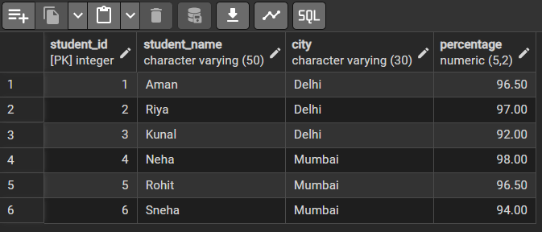

# Experiment 2

## Aim of the Session
To analyze student performance data using SQL queries by applying conditional logic (CASE statement) and 
aggregate functions to identify high-performing students across different cities.

## Objective of the Session
- To understand the use of the CASE statement in SQL.
- To calculate the count of students having percentage greater than 95.
- To find the average percentage of high-performing students city-wise.
- To apply ORDER BY clause to sort results in descending order.
- To gain practical exposure to conditional and aggregate queries in SQL.

## Practical / Experiment Steps
- Analyze the given Students database table.
- Identify students whose percentage is greater than 95.
- Use CASE statement to count students meeting the condition.
- Calculate city-wise average percentage for students scoring above 95.
- Sort the results based on percentage in descending order.
- Execute the queries and verify the output.

## Procedure of the Experiment
1. Start the system and log in to the computer.
2. Open the required database software PostgreSQL.
3. Create or select the database containing the Students table.
4. Verify the structure of the table using appropriate SQL commands.
5. Write an SQL query using CASE statement to count students with percentage greater than 95.
6. Write another SQL query to calculate the city-wise average percentage of students scoring above 95.
7. Apply ORDER BY clause to sort the result in descending order.
8. Execute the SQL commands one by one.
9. Verify the output obtained after execution.
10. Save the work and capture screenshots for record.

## Input / Output Details
### Input:
- Table Name: Students
- Columns Used:
    StudentID
    StudentName
    City
    Percentage
- Condition:
  Percentage > 95

### Output:
- Count of students having percentage greater than 95.
- City-wise average percentage of students with percentage greater than 95.
- Results displayed in descending order of percentage.

## Learning Outcome
- Understood the use of CASE statement for conditional logic in SQL.
- Learned how to apply aggregate functions such as COUNT and AVG.
- Gained practical knowledge of sorting data using ORDER BY.
- Developed the ability to analyze academic data for performance evaluation.
- Improved hands-on experience with SQL query execution and result verification.

## Screenshots
### Input table

### Without Case Statement

### With case statement

### Percentage above 95

